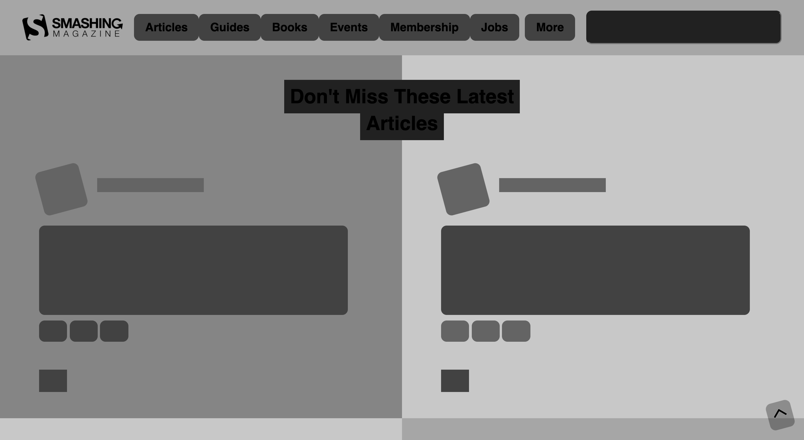
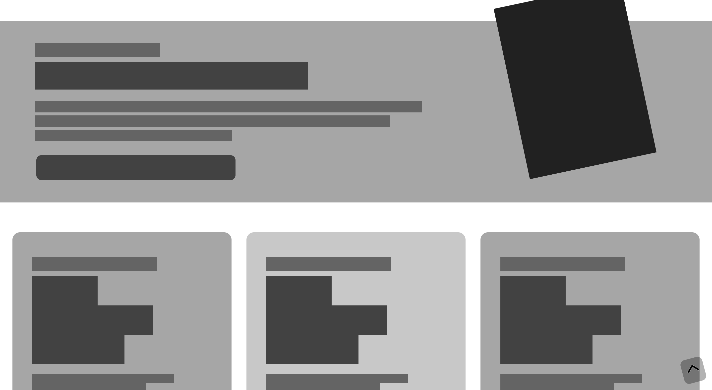
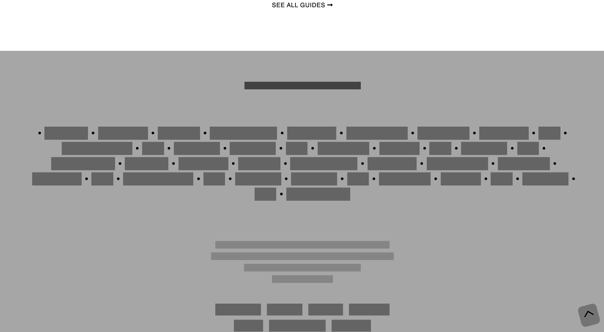

# Smashing Magazine Heatmap 🚧

> This project is a deconstruction of the website of popular internet magazine, Smashing Magazine. After recreating the structure of the original website, we coloured our version with greyscale according to the visual hierarchy of the original, in order to show where the website's design draws the eye using design principles like contrast, repetition, alignment and proximity. 

The darkest shades represent the most eye-catching elements and the lightest colours represent the least eye-catching.

You can check out Smashing Magazine's original website [here](https://www.smashingmagazine.com/).

## Built With 🧰

- HTML
- CSS

## Live Demo 🔴

Check out a live version of the site here:

[Live Demo Link](https://friendly-noether-ef07d0.netlify.app/)

## Getting Started 🏁

To get a local copy up and running simply open the terminal, navigate to your desired location for a local version of this project and then enter the following line of code:

git clone https://github.com/ershadul1/Heatmap-of-Smashing-Magazine.git

Once the contents of this repository are on your computer, just open index.html with your preferred browser!

### Prerequisites

- A computer
- Internet connection
- A browser of choice

## Authors

👤 **Joseph Burke**

- Github: [@Joseph-Burke](https://github.com/Joseph-Burke)
- Twitter: [@__joeburke](https://twitter.com/__joeburke)
- Linkedin: [Joseph-Burke](https://www.linkedin.com/in/joseph-burke-b7a8261a5/)
- Email: joseph_burke@outlook.com

👤 **Ershadul Hakim Rayhan**

- Github: [@ershadul1](https://github.com/ershadul1)
- Email:  ershadul.rayhan@gmail.com
- Twitter: [@ErshadulRayhan](https://twitter.com/ErshadulRayhan)
- Linkedin: [ErshadulRayhan](https://www.linkedin.com/in/ershadulrayhan/)

## 🤝 Contributing

Our favourite contributions are issues! Help us improve our project by creating an issue and letting us know what you think of our work.

## Show your support

Give a ⭐️ if you like this project!

## Acknowledgments

- Microverse
- The Odin Project

## 📝 License

This project is [MIT](lic.url) licensed.
